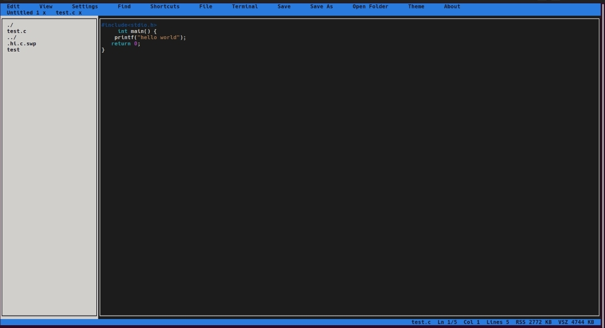

---

##  Features

-  **~50KB binary**
-  **Syntax highlighting**
-  **Built-in theme creator**
-  **Keyboard-focused workflow**
-  **Instant startup**
-  **Linux native**

---

##  Why use TASCI?

Most modern text editors are powerful — but often bloated, slow to start, or packed with features you may never use.

**TASCI keeps things simple.**

It is designed to be **tiny, fast, responsive, and clean**, while still looking good out of the box.

If you want a lightweight terminal editor that starts instantly, feels smooth, and stays out of your way while coding, **TASCI is worth trying.**

---

## 📦 Installation

```bash
git clone https://github.com/tasic928/TASCI-text-code-editor.git
cd TASCI-text-code-editor
make
./tasci
````

---

##  Preview

TASCI running with syntax highlighting and theming support.

<p align="center">
  
</p>

---

##  Goals

* Stay lightweight
* Stay fast
* Look good by default
* Be enjoyable to use

---


